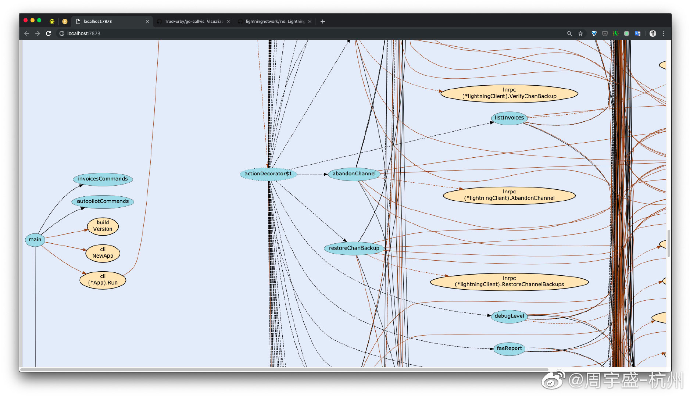
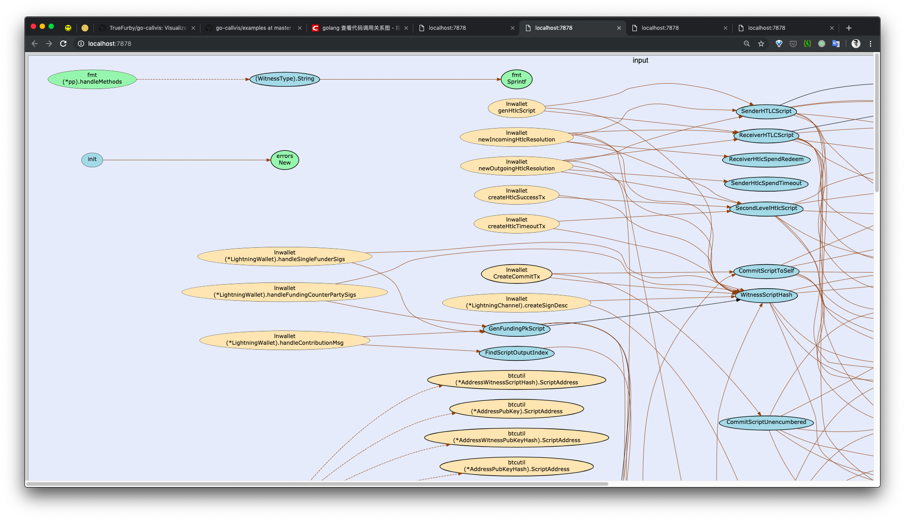
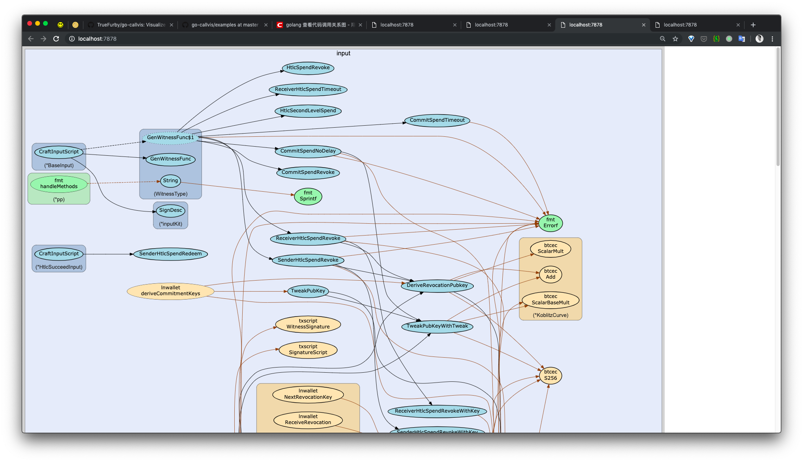
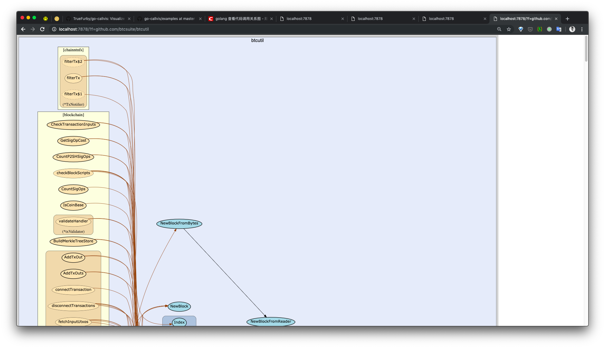
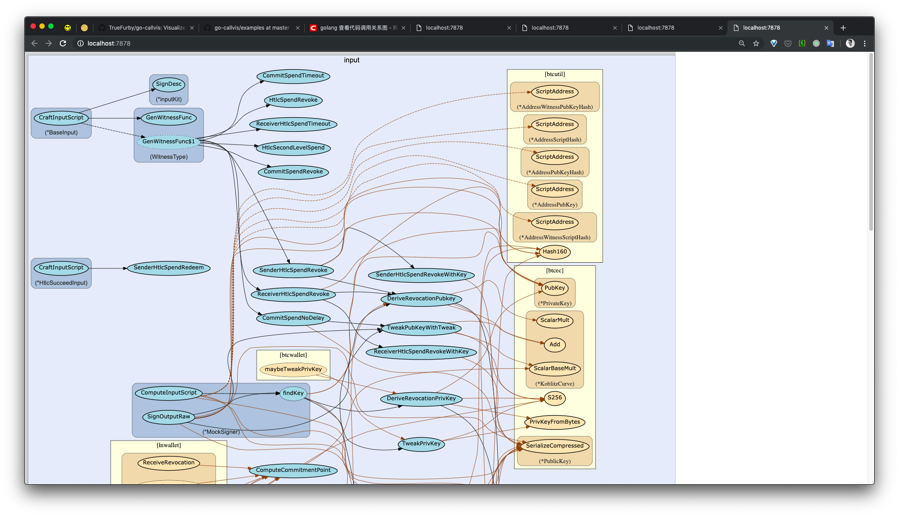

# Use flags
Use package github.com/lightningnetwork/lnd as an example.

Because the `main.go` is locate in `github.com/lightningnetwork/lnd/cmd/lncli`, so execute:

```
go-callvis github.com/lightningnetwork/lnd/cmd/lncli
```
then the browser will open link http://localhost:7878/ automatically, showing the dependency graph of the whole project.


But the graph is too complex, so many lines tangle together, which is hard to analyse.


## `-focus` flag
To focus in one module of it, for example `input` module, you can add `-focus` flag followed by the the name or the path of `input` module:
```
go-callvis -focus input github.com/lightningnetwork/lnd/cmd/lncli
```

or

```
go-callvis -focus github.com/lightningnetwork/lnd/input github.com/lightningnetwork/lnd/cmd/lncli
```

> -focus string
>
>   Focus package with import path or name. (default: main)
>
> https://github.com/TrueFurby/go-callvis



## `-group` flag

It can make the graph more organized. There are 2 kinds of group: pkg, type.

After add `-group type`:
```
go-callvis --group type -focus input github.com/lightningnetwork/lnd/cmd/lncli
```

Some dependencies will be grouped into boxes with different types:



After add `-group pkg,type`(notice that it's not `-group pkg, type`, which has an extra space):
```
go-callvis --group pkg,type -focus input github.com/lightningnetwork/lnd/cmd/lncli
```

Some packages will be grouped into boxes of different modules, for example `fmt`.


Box of packages can be clicked, to focus on that. After click on the box of `btcutil`, browser jump to link of http://localhost:7878/?f=github.com/btcsuite/btcutil.




> -group string
>
> Grouping functions by packages and/or types. [pkg, type] (separated by comma)
>
> https://github.com/TrueFurby/go-callvis


## `-nostd` flag

It makes packages in standard library ignored, makes the graph simpler.
```
go-callvis -nostd --group pkg,type -focus input github.com/lightningnetwork/lnd/cmd/lncli
```



> -nostd
>
> ​	Omit calls to/from packages in standard library.
>
> https://github.com/TrueFurby/go-callvis
